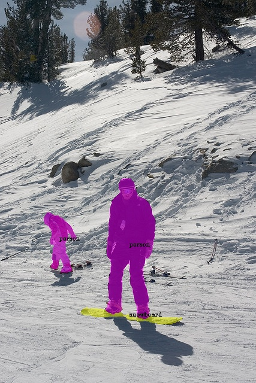
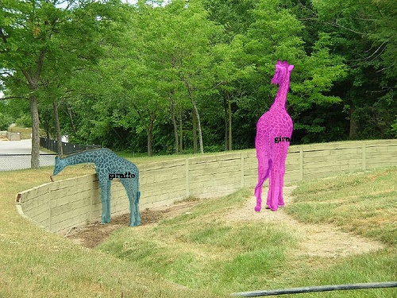
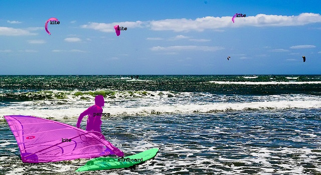

# TensorRT  SOLOv2
### Introduction

​		This project is based on SOLOv2 instance segmentation, and the model is deployed with tensorRT, aiming to attract jade.【不需要libtorch，纯TensorRT部署SOLOv2，可快速移植至NX/TX2.】

### Show result








### Get model

Download link:  https://pan.baidu.com/s/1lX6n44CtXlqdIV0NiS8jXA

Code: fw8f

### Run example

**1. go to the build directory.**

```powershell
SOLOv2-TensorRT$ cd build
```

**2. run command.**

```powershell
 ./convertModel ./solov2_r50_fpn_8gpu_3x.onnx -g ./seg_coco_permute.bin
```

**3. run command.**

```powershell
SOLOv2-TensorRT/build$ make clean
```

**4. Compile the project.**

```powershell
SOLOv2-TensorRT/build$ make

-- The C compiler identification is GNU 7.5.0
-- The CXX compiler identification is GNU 7.5.0
-- Check for working C compiler: /usr/bin/cc
-- Check for working C compiler: /usr/bin/cc -- works
-- Detecting C compiler ABI info
-- Detecting C compiler ABI info - done
-- Detecting C compile features
-- Detecting C compile features - done
-- Check for working CXX compiler: /usr/bin/c++
-- Check for working CXX compiler: /usr/bin/c++ -- works
-- Detecting CXX compiler ABI info
-- Detecting CXX compiler ABI info - done
-- Detecting CXX compile features
-- Detecting CXX compile features - done
-- Found CUDA: /usr/local/cuda-11.0 (found version "11.0") 
-- Found OpenCV: /usr/local/opencv3 (found version "3.4.10") 
-- Configuring done
-- Generating done
-- Build files have been written to: ../SOLOv2-TensorRT/build
Scanning dependencies of target SOLOv2-TensorRT
[ 33%] Building CXX object CMakeFiles/SOLOv2-TensorRT.dir/src/segmentation_trt.cpp.o
[ 66%] Building CXX object CMakeFiles/SOLOv2-TensorRT.dir/src/demo.cpp.o
[100%] Linking CXX executable SOLOv2-TensorRT
[100%] Built target SOLOv2-TensorRT
```

**5. run the demo program.**

```powershell
SOLOv2-TensorRT/build$ ./SOLOv2-TensorRT -image_path ../image/1.jpg -save_path ./demo1.jpg

curr opencv version 3.4.10
num of classes: 80
[04/19/2022-16:58:56] [W] [TRT] TensorRT was linked against cuDNN 8.0.5 but loaded cuDNN 8.0.2
[04/19/2022-16:58:56] [W] [TRT] TensorRT was linked against cuBLAS/cuBLAS LT 11.2.0 but loaded cuBLAS/cuBLAS LT 11.1.0
[04/19/2022-16:58:56] [W] [TRT] TensorRT was linked against cuDNN 8.0.5 but loaded cuDNN 8.0.2
[04/19/2022-16:58:56] [W] [TRT] TensorRT was linked against cuBLAS/cuBLAS LT 11.2.0 but loaded cuBLAS/cuBLAS LT 11.1.0
person 0.851572
person 0.763859
snowboard 0.460805
0.683118 seconds
```

